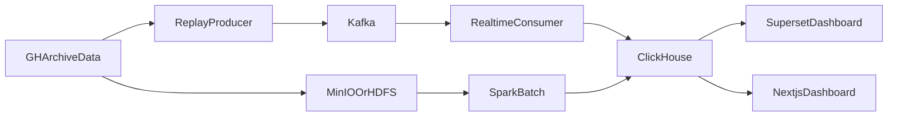

# GitHub Stream-Batch Analytics

`GitHub Stream-Batch Analytics` 是一个面向大数据处理课程的 GitHub 开发者行为流批分析系统。项目使用 `GH Archive` 作为主数据源，通过历史事件重放模拟实时流，同时保留历史全量数据用于离线分析，最终将实时和离线结果统一展示到可视化看板中。

## 项目目标

- 使用 `Kafka` 承载 GitHub 事件流。
- 使用轻量实时消费者进行本地实时窗口聚合、热度评分和异常检测，并保留 `Flink SQL` 方案作为扩展实现。
- 使用 `Spark` 进行历史趋势、行为画像和周级汇总分析。
- 使用 `MinIO` 保存原始文件和中间产物。
- 使用 `ClickHouse` 保存查询结果，为 `Next.js` 和 `Superset` 提供数据。

## 核心分析问题

- 哪些仓库正在变热？
- 哪些事件类型在最近一段时间内增长最快？
- 某些仓库是否出现了异常活跃突增？
- 人类账号和 Bot 账号的行为差异是什么？
- 实时窗口统计和离线全量统计之间有什么偏差？

## 推荐数据范围

- 数据源：`GH Archive`
- 时间范围：连续 `7` 天
- 建议事件：`PushEvent`、`WatchEvent`、`ForkEvent`、`IssuesEvent`、`PullRequestEvent`
- 原始数据规模：约 `2 GB - 10 GB`

## 系统架构



## 项目结构

```text
.
|-- apps
|   `-- web
|-- configs
|   `-- clickhouse
|-- data
|   |-- raw
|   `-- sample
|-- docs
|-- jobs
|   |-- batch
|   |-- common
|   |-- ingest
|   |-- replay
|   `-- streaming
|-- scripts
|-- docker-compose.yml
`-- requirements.txt
```

## 主要模块

### 1. 数据采集

`jobs/ingest/download_gharchive.py`

- 按天或按小时下载 `GH Archive` 数据。
- 只保留课程项目需要的 GitHub 事件类型。
- 支持本地保存和上传到 `MinIO`。

### 2. 事件重放

`jobs/replay/replay_gharchive_to_kafka.py`

- 读取 `json.gz` 文件并解析 GitHub 事件。
- 按事件时间顺序写入 `Kafka`。
- 支持加速回放，便于课堂演示实时效果。

### 3. 实时分析

`jobs/streaming/flink_job.py`

- 当前默认实现是基于 `KafkaConsumer` 的轻量实时消费者，适合本地和课堂演示。
- 统计分钟级事件量。
- 计算仓库热度分数。
- 检测仓库热度突增。
- 识别 Bot 与人类账号占比。
- `jobs/streaming/flink_sql_job.sql` 保留为后续接入真实 `Flink` 集群时的扩展方案。

### 4. 离线分析

`jobs/batch/spark_job.py`

- 计算日级和周级趋势。
- 统计语言活跃度、事件分布和开发者节律。
- 生成高级离线分析：仓库综合评分、趋势预测、短期爆发 vs 长期稳定。
- 输出可解释字段（热度分量、动量、稳定度、Bot 占比）支撑可视化展示。

### 5. 可视化展示

- `Next.js`：正式仪表盘前端，适合课程汇报和美观展示。
- `Superset`：承载正式仪表盘。
- `Streamlit`：用于备用演示入口页，作为前端降级方案。

## 六个核心指标

1. 实时事件流监控
2. 热门仓库榜单
3. 历史趋势分析
4. 异常活跃检测
5. 开发者活跃节律分析
6. 人类与 Bot 行为对比

## 快速开始

### 1. 安装本地依赖

```bash
pip install -r requirements.txt
npm install --prefix apps/web
```

本项目建议环境：

- `Python 3.12`
- `Node.js 22`
- `npm 10`
- `Java 17`
- `Docker Desktop 28+`

### 2. 启动基础服务

```bash
docker compose up -d zookeeper kafka clickhouse minio superset
```

如果想把正式前端也放进容器一起启动：

```bash
docker compose up -d zookeeper kafka clickhouse minio superset web
```

### 3. 准备样例数据

```bash
powershell -ExecutionPolicy Bypass -File scripts/bootstrap_sample_data.ps1
```

如果需要下载真实数据并同步归档到 `MinIO`：

```bash
python jobs/ingest/download_gharchive.py --date 2024-01-01 --hours 0 1 2 --output-dir data/raw --upload-minio
```

### 4. 启动实时消费者

```bash
python jobs/streaming/flink_job.py
```

### 5. 将样例数据回放到 Kafka

```bash
python jobs/replay/replay_gharchive_to_kafka.py --input data/raw --topic github_events --speedup 600
```

### 6. 运行 Spark 离线任务

```bash
python jobs/batch/curate_events.py --input data/raw --output data/curated
python jobs/batch/spark_job.py --input data/curated --output data/sample
python scripts/load_batch_metrics_to_clickhouse.py --input data/sample
```

说明：

- `curate_events.py` 负责把原始 `GH Archive JSON` 清洗成统一的 `Parquet` 标准化数据层。
- `spark_job.py` 负责基于清洗后的 `Parquet` 生成基础 + 高级离线指标。
- `load_batch_metrics_to_clickhouse.py` 会同时装载基础表与高级分析表（排名、趋势预测、爆发稳定、节律热图等）。

### 7. 启动正式前端

```bash
npm run dev --prefix apps/web
```

如果使用容器化前端，可直接访问 `http://localhost:3000`。

### 8. 一键启动演示链路

**日常恢复（不丢数据，最常用）**：

```powershell
powershell -ExecutionPolicy Bypass -File scripts\resume.ps1
```

启动 ClickHouse（持久卷，表数据自动保留）+ Next.js 开发服务器。
不会触发任何数据重建。

**安全停止**：

```powershell
powershell -ExecutionPolicy Bypass -File scripts\stop_all.ps1
```

只 `docker compose stop`，**不删容器、不删卷**，下次 `resume.ps1` 数据原样在。

**首次或需要重算离线表时**：

```powershell
powershell -ExecutionPolicy Bypass -File scripts\run_batch_pipeline.ps1
```

> 数据持久化细节（哪些操作会丢数据、如何迁移、如何恢复）：见
> [`docs/data_persistence.md`](docs/data_persistence.md)。

其他入口：

- `scripts\start_all.ps1` —— 首次完整链路（Kafka + Flink + 回放 + 批处理 + Next.js）。
- `scripts\run_demo_pipeline.ps1` —— 答辩演示专用链路。
- `scripts\migrate_clickhouse_volume.ps1` —— **一次性**把旧容器里的数据
  迁入命名卷（首次升级持久化配置后执行一次即可，幂等可重跑）。

## 开发建议

- 先跑通正式链路：样例数据、回放、实时消费者、Spark、ClickHouse、`Next.js`。
- 再补 `Superset` 仪表盘和 `MinIO` 归档展示。
- 最后视时间接入真实 `Flink` 作业。

## 演示策略

- 正式演示时使用一段固定的 `GH Archive` 数据做回放。
- 保留一份录屏作为故障兜底方案。
- 展示层统一使用 `Next.js`，避免双前端入口增加维护成本。
- 实时与离线图表使用同一套指标命名，方便答辩说明。