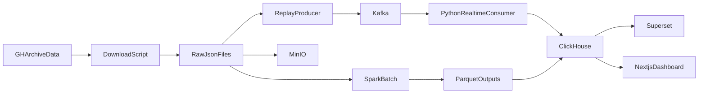

# 系统架构说明

## 1. 项目定位

本项目面向大数据处理课程，主题为 `GitHub 开发者行为流批分析系统`。系统目标是同时覆盖：

- 历史全量数据的离线分析
- 基于事件重放的准实时分析
- 最终可视化展示与答辩演示

## 2. 技术选型

### 数据源

- 主数据源：`GH Archive`
- 辅助数据源：`GitHub API`（可选）

### 大数据组件

- `Kafka`：事件总线
- 轻量实时消费者：本地演示默认的实时处理实现
- `Flink SQL`：保留的正式扩展方案
- `Spark`：离线分析
- `MinIO`：对象存储
- `ClickHouse`：分析型数据库
- `Next.js / Superset`：可视化层

## 3. 架构分层

### 数据采集层

- 下载指定日期范围内的 `GH Archive` 数据。
- 过滤到本项目关注的 5 类事件。
- 保存为本地 JSON Lines，后续可扩展为对象存储归档。

### 实时处理层

- 将历史事件按时间顺序回放到 `Kafka`。
- 默认由轻量 Python 实时消费者消费 `Kafka` 事件流。
- 输出分钟级指标、热点仓库分数和异常告警。
- 实时结果写入 `ClickHouse`。
- 若后续时间充足，可将同样逻辑迁移到 `Flink SQL` 作业。

### 离线分析层

- `Spark` 从原始事件文件中读取全量数据。
- 计算日级统计、行为节律和 Bot 占比等长期指标。
- 离线结果保存为 Parquet，并进一步装载到 `ClickHouse`。

### 展示层

- `Next.js` 用于正式课程仪表盘、像素风总览页和演示大屏。
- `Superset` 用于补充 BI 仪表盘。

## 4. 数据流

## 5. 课程展示亮点

- 体现了 `流处理 + 批处理` 的完整链路。
- 体现了 `消息中间件 + 分析型数据库 + 仪表盘` 的系统设计能力。
- 实时与离线统一到同一展示层，更容易向老师解释系统价值。
- 可以通过固定数据回放保证演示稳定。
- 前端采用更正式的 `Next.js` 仪表盘，演示观感更接近真实分析平台。
